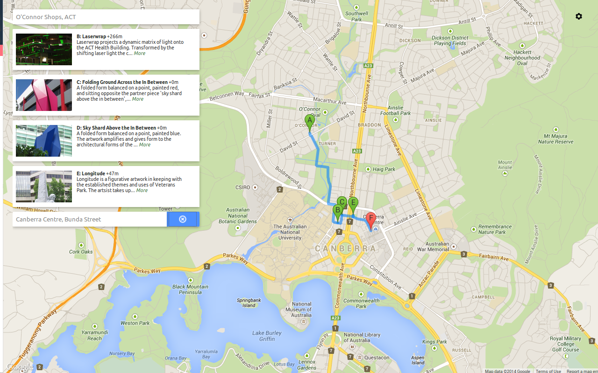

Inefficient-Directions
======================

Plan scenic walks between two given locations.

This project was awarded (ACT) Digital ***REMOVED*** Entrepreneur and 2nd Place (National) Best Schools Team.

Inefficient Directions is a GovHack [1] built upon [data.act.gov.au][data.act.gov.au] dat and [Google Maps](maps.google.com).

Tools Used
===

The application is all done client side using javascript. Extra libraries were JQuery [2] and Google Maps API v3 [3] .
The data, taken from data.act.gov.au, is stored in JSON files.

[1] [govhack.org]
[2] [jquery.com]
[3] [https://developers.google.com/maps/]
