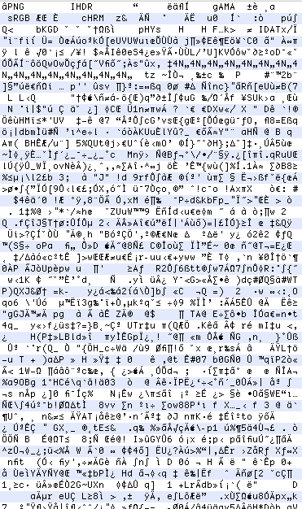

# PNG-Decoder

This is a simple educational PNG decoder written in Java.

What does it do?
----------------

A PNG decoder turns this:

</a>

into this:

</a>

Why?
----

This project was started for the purpose of:

1. Continuing my learning of Java
2. Implementing popular (de)compression algorithms (LZ77, Huffman)
3. Learning more about file formats (starting with PNG)

TODO
----

This is a work in progress. TODO:

* I've currently used JAVA's built-in ZLIB deflater as a place-holder class. I intend on implementing that component from scratch.
* Not all PNG options are implemented. e.g. interlacing, some color types.
