Expresso-Parser
===============

This was a group assignment for ANU's COMP2100 course. I wrote this app together with one other student. The focus of the assignment was the expression parser, rather than the app itself. Instead of writing a parser by hand, we wrote a *parser generator*, using the LALR algorithm to build dynamic LR tables, allowing us to define valid inputs in a text file using BNF-like syntax.

Expresso-Parser is an expression parser and calculator interface for Android.

Features
--------

It's calculator features include:

* All basic operations  

* Functions  
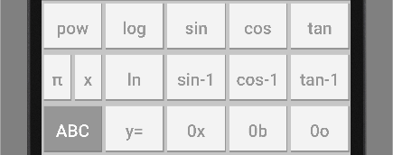
* Bitwise operations  
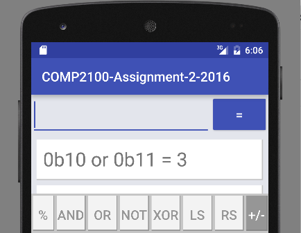
* Units  
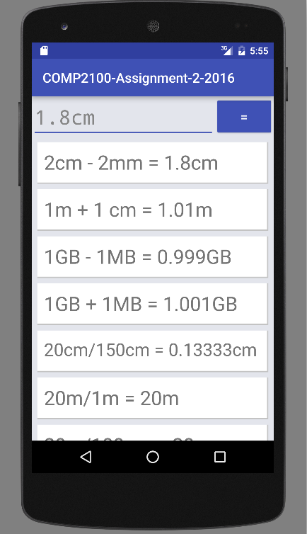
* Different bases  
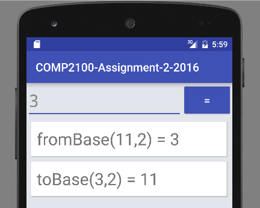
* Plotting  
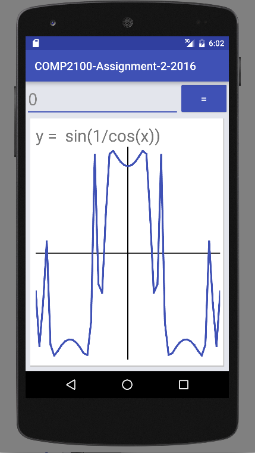
* Constants  
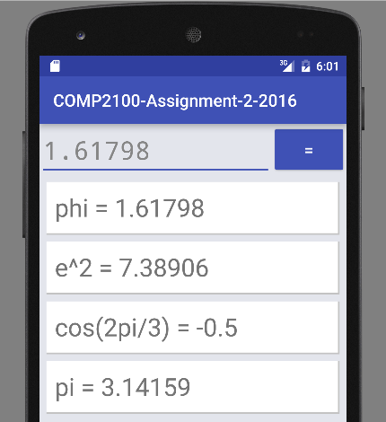
* Maths keyboard  
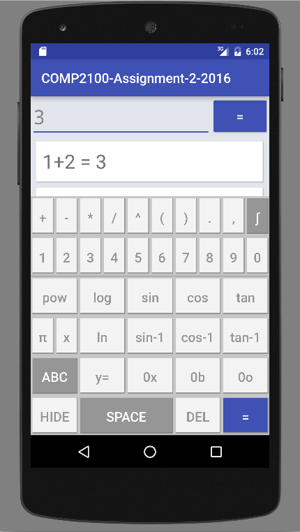
* Error reporting  
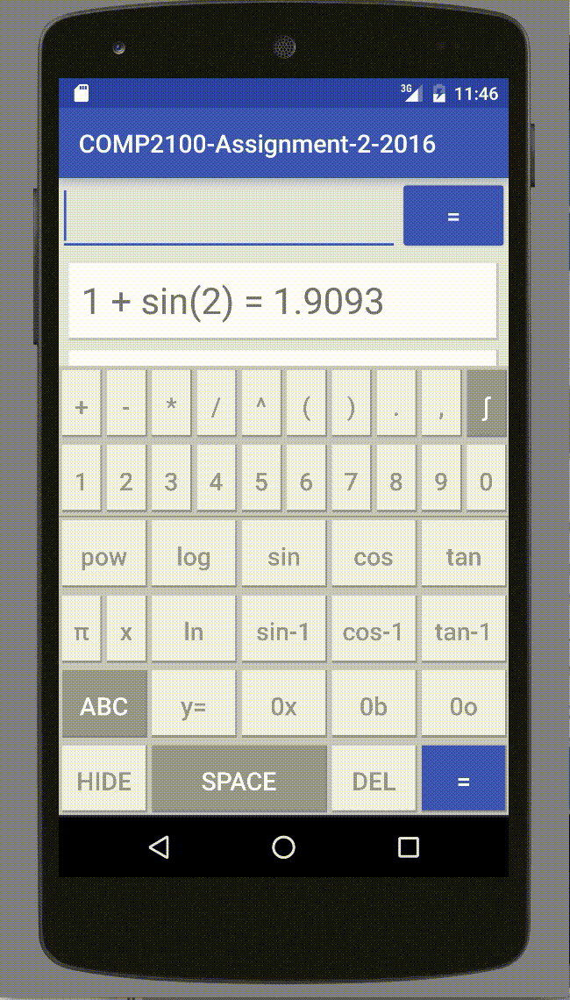<a/>
* Loading screen (first load takes ~5/10 seconds)  


User Interface
=====================

There is only one activity. It features:

* An EditText and TextView that resizes text too long to fit  
Textview:  
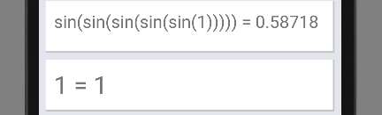
EditText:  

* A list of the 20 most recent queries (in auto-fitting TextViews). Clicking an entry will add that query into the main EditText.
* A maths keyboard with multiple layouts  
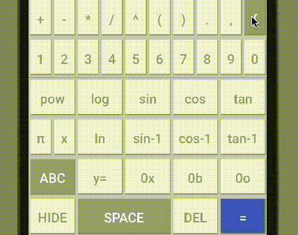


Software Design
===============

The app displays multiple software design patterns, but overall, the classes have been designed to seperate the view and the control of elements, while retaining the compact object oriented modular design.

Expressions: The Expressions use the Interpreter behavioural pattern, using a base abstract Expression class with the basic behaviour and abstract functions and a class for every terminal and non-terminal symbol in the grammar.

History View: The History controller uses the Adapter structural pattern in order to show both standard calculation results as well as graphs. The view expects only a plain History element, requiring this model to show the graph entries as well.


UML Diagrams
------------

The design is split into three main packages. Each is outlined with their respective UML diagram:

-----
Overall package:
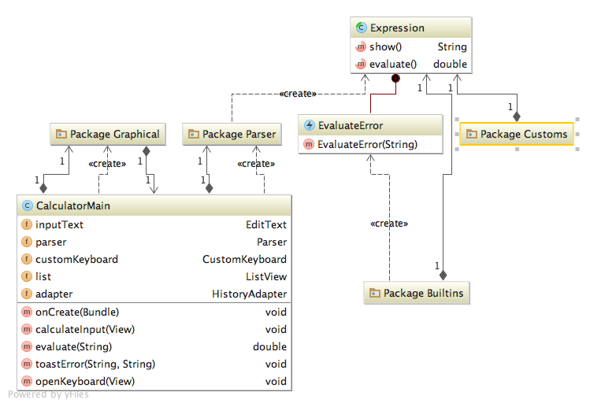

-----
Graphics package:
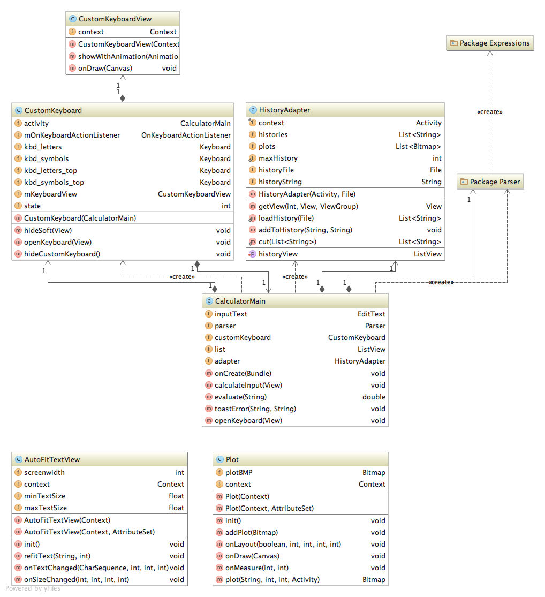

-----
Parser package:
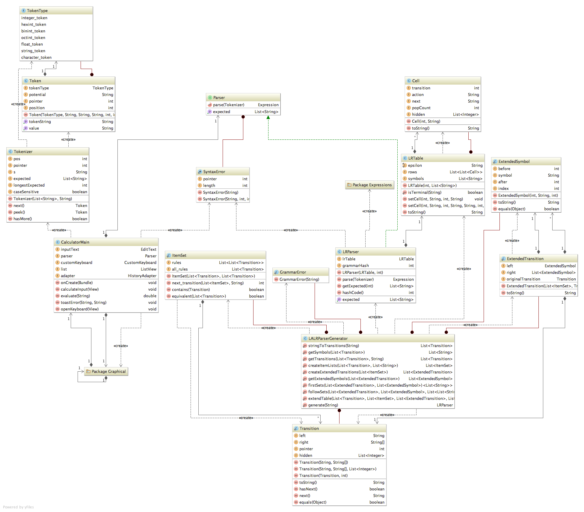

-----
Expressions package:
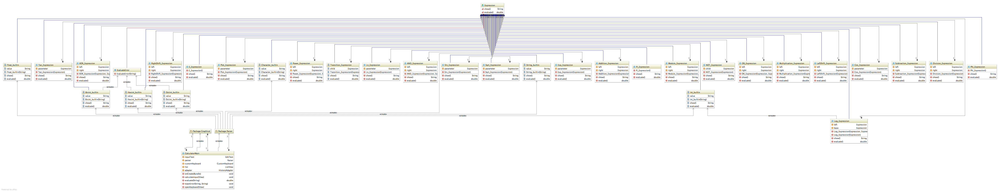

Feature Details
===============

Parser Generator
----------------

The parser is automatically generated (at launch) from a grammar file written in a syntax based on BNF. The parser generator uses the LALR (look-ahead left right) algorithm to build a compact and efficient LR-table, which is then used by a LR-parser.

The grammar can be found in assets/grammar.txt or attached at the end of this file.

In order to speed up the loading of the app, the generated parser table is stored to disk as a serialised object, calculating the grammar's hash value to check if it has changed.

The parser generator was written by first writing a LALR parser by hand following [this guide](http://web.cs.dal.ca/~sjackson/lalr1.html) and then automating every individual step.


Plots
-----

Plotting works by replacing x with values from -5.0 to 5.0 with increments of 0.1 and approximating the values in between with a simple degree-1 line.


History
-----------------

History works by storing storing the input and output of every evaluate function to a txt file using a modified ArrayAdapter. It also displays the graph plot of saved plots by checking if the saved input starts with y=. The history only stores the last 20 entries to avoid clutter.


Design Decisions
================

Using a parser instead of a parser generator was a big risk, being a lot more complicated to implement, but we decided it would be worth while, given the advantage of being able to easily add new expressions to our grammar.


Missing Features, known bugs
============================

* Currently, the plot's x-axis is always at the centre of the plot, even when the plot is shifted (although this would only take two minutes to fix)
* There's a bug in Windows which causes problems with the parser generator. This hasn't been tested on a second version of Windows, so it may be local to the faulty computer.


Challenges
==========

* Fitting all the functions we wanted onto the keyboard without making it too cluttered meant deciding which ones were more important than others.
* Writing a parser generator from scratch


Libraries and resources used
============================

No libraries were used. Relevant resources have been sourced above the respective code.


Testing
=======

(TODO: Copy from private server)
See [the testing page](https://gitlab.cecs.anu.edu.au/***REMOVED***/COMP2100-Assignment-2-2016/wikis/testing) for details on the unit and integration tests.  
  
  

Grammar
=======

```
# Authors: ***REMOVED***, Reilly

# Basic guide:
# 1) A non-terminal symbol starts with a $
# 2) A -> B | C is equivalent to A -> B, A -> C
# 3) For every non-terminal, $A, there must be a class Expressions.Custom.A_Expression, unless
#    it's name starts with '_' (e.g. $_A).
# 4) That class must have the same number of constructor parameters as it has right-hand side
#    symbols in the rule, not counting anything that starts with an underscore, '_'.
# 5) Anything starting with '#' is a comment
# 6)

$_Expression -> $_Precedence1 | _y _= $Plot


# +,-
$_Precedence1 -> $Addition | $Subtraction | $_Precedence2
$Addition -> $_Precedence1 _+ $_Precedence2
$Subtraction -> $_Precedence1 _- $_Precedence2 | $_Epsilon _- $_Precedence2

# *,/,%
$_Precedence2 -> $Multiplication | $Division | $Modulo | $_Precedence3
$Multiplication -> $_Precedence2 _* $_Precedence3 | $_Precedence2 $_Precedence3
$Division -> $_Precedence2 _/ $_Precedence3
$Modulo -> $_Precedence2 _% $_Precedence3

# ^
$_Precedence3 -> $Power | $_Precedence4
$Power -> $_Precedence3 _^ $_Precedence4 | _pow _( $_Precedence1 _, $_Precedence1 _)

# TODO: add $OR, $XOR, etc...
$_Precedence4 -> $AND | $OR | $NOT | $XOR | $LeftShift | $RightShift | $_Precedence5
$AND -> $_Precedence4 _and $_Precedence5
$OR -> $_Precedence4 _or $_Precedence5
$NOT -> _not _( $_Precedence1 _)
$XOR -> $_Precedence4 _xor $_Precedence5
$LeftShift -> $_Precedence4 _<< $_Precedence5
$RightShift -> $_Precedence4 _>> $_Precedence5

$_Precedence5 -> $_Function | $_Precedence6

$_Function -> $Sin | $Cos | $Tan | $Asin | $Acos | $Atan | $Log | $Ln | $Exp | $Sqrt | $Fact | $FromBase | $ToBase

$Sin -> _sin _( $_Precedence1 _)
$Cos -> _cos _( $_Precedence1 _)
$Tan -> _tan _( $_Precedence1 _)
$Asin -> _asin _( $_Precedence1 _)
$Acos -> _acos _( $_Precedence1 _)
$Atan -> _atan _( $_Precedence1 _)
$Log -> _log _( $_Precedence1 _, $_Precedence1 _) | _log _( $_Precedence1 _)
$Ln -> _ln _( $_Precedence1 _)
$Sqrt -> _sqrt _( $_Precedence1 _)
$Exp -> _exp _( $_Precedence1 _)
$FromBase -> _fromBase _( $_Precedence1 _, $_Precedence1 _)
$ToBase -> _toBase _( $_Precedence1 _, $_Precedence1 _)
$Fact -> $_Precedence6 _!

$_Precedence6 -> $_Constant | $_Number | $_Unknown | $UnitNum | _( $_Precedence1 _)

$UnitNum -> $_Number $Unit

$_Number -> int | float | hexint | binint | octint

$_Constant -> $Pi | $E | $Phi
$Pi -> _pi | _π
$E -> _e
$Phi -> _phi | _ϕ

$Unit -> $_Distance | $_Memory

$_Distance -> km | m | cm | mm
$_Memory -> B | KB | MB | GB

$Plot -> $_Precedence1

$_Unknown -> x

$_Epsilon -> ε
```
  
  
  
That's all. Expresso-Parser by Reilly and ***REMOVED***.
