# Project Archive

A collection of archived projects, scripts and programs.

# 2020, 2022

-   <a href="https://github.com/0x31/australian-flora">Australian Flora Search</a> [2020, 2022] - A search engine and data aggregator for Australian native plants

# 2019

-   <a href="./pr-oof">pr-oof</a> [2019] - propositional logic proof verifier in Elm

# 2017

-   <a href="./XScreenSaver-js">XScreenSaver-js</a> [2017] - A couple of XScreesavers implemented in JS

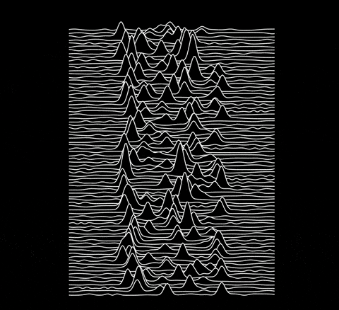
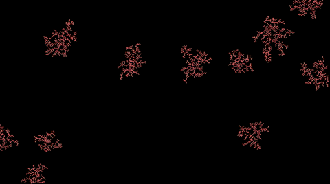
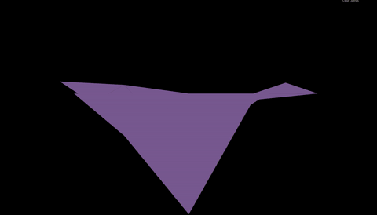
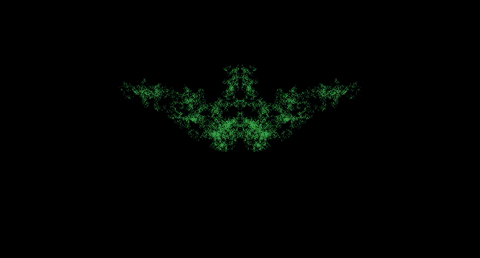

# 2016

-   <a href="./Expresso-Parser">Expresso-Parser</a> [2016] - Language Parser Generator used for calculator (uni assignment)

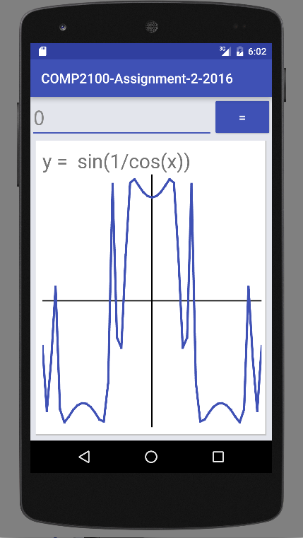

-   <a href="./Notedown">Notedown</a> [2016] - JAVA markdown Android app (uni assignment)

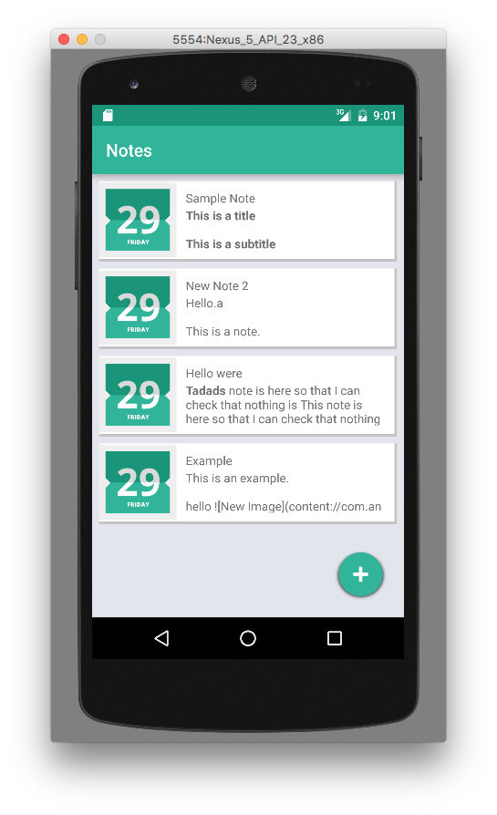
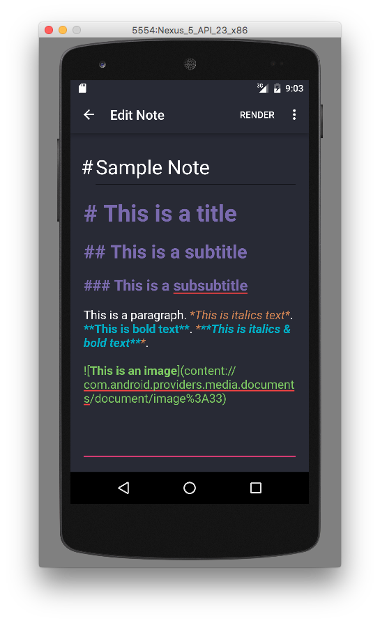

-   <a href="./PNG-Decoder">PNG-Decoder</a> [2016] - PNG decoder in Java

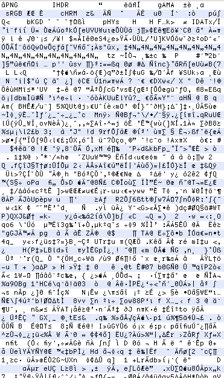
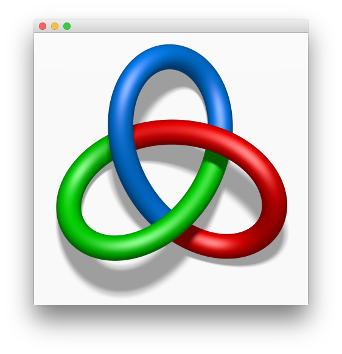

-   <a href="./xtm-parallel-coordinates">xtm-parallel-coordinates</a> [2016] - Graphing library built in Extempore

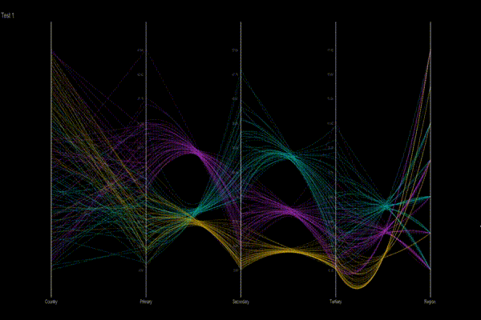
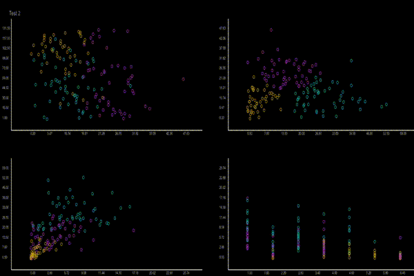

-   <a href="./xtm-physics">xtm-physics</a> [2016] - Simple 2D physics engine built in Extempore

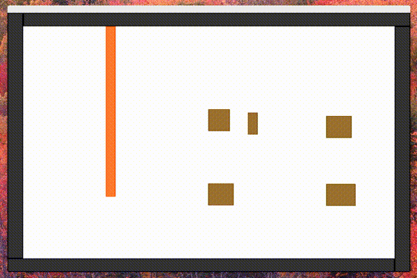

-   <a href="./Govhack">Govhack [201</a> -2016] - Series of hackathon entries

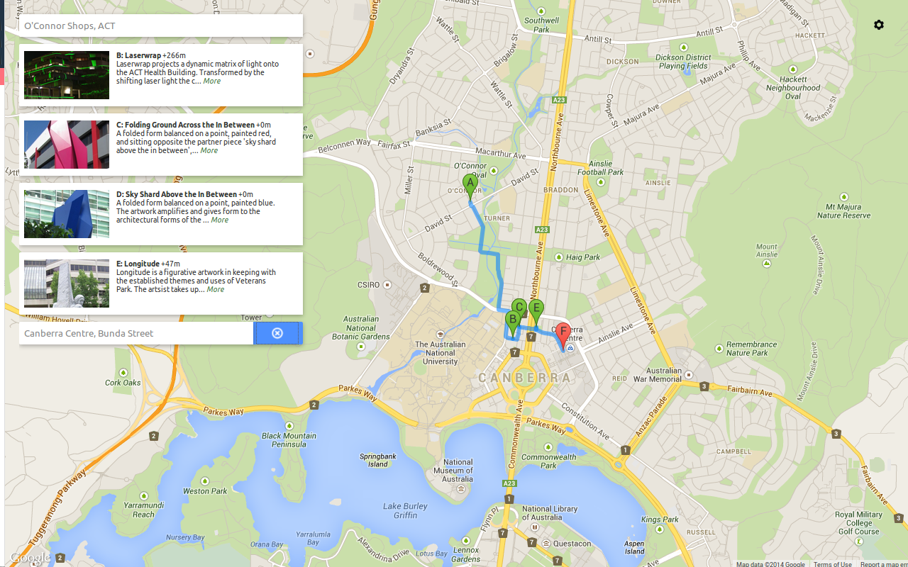

-   <a href="./arduino-guitar-pedal">arduino-guitar-pedal</a> [2016] - Arduino guitar effects pedal

# 2015

-   <a href="./Blockus-Java">Blockus-Java</a> [2015] - Blockus Android app (uni assignment))

 

-   <a href="./dash">dash</a> [2015] - TODO webapp

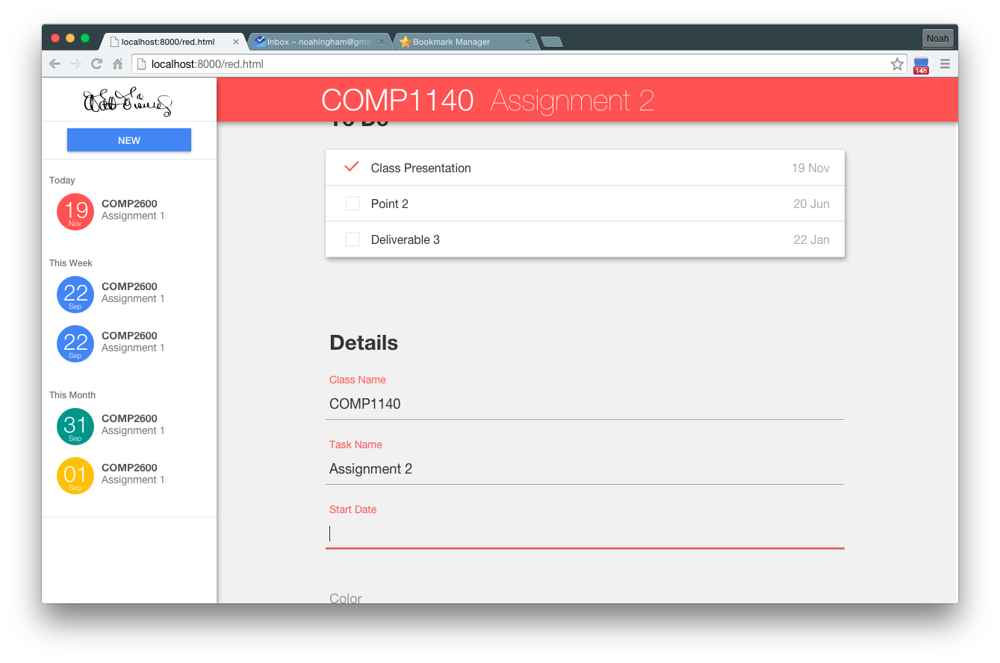
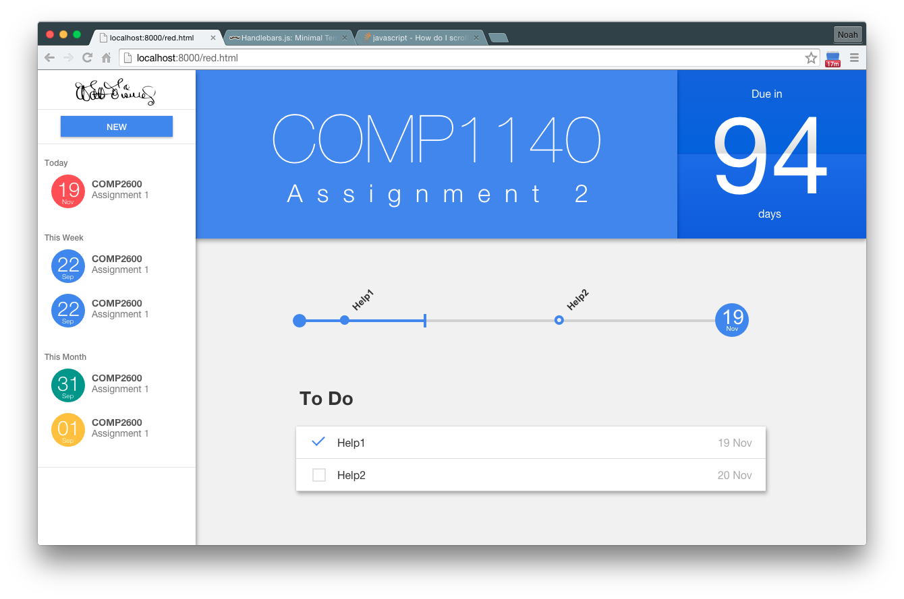

-   <a href="./rPeANUt-js">rPeANUt-js</a> [2015] - Hardware simulator and interface

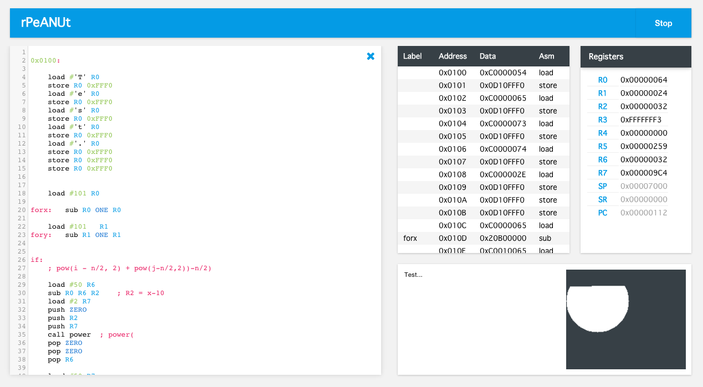
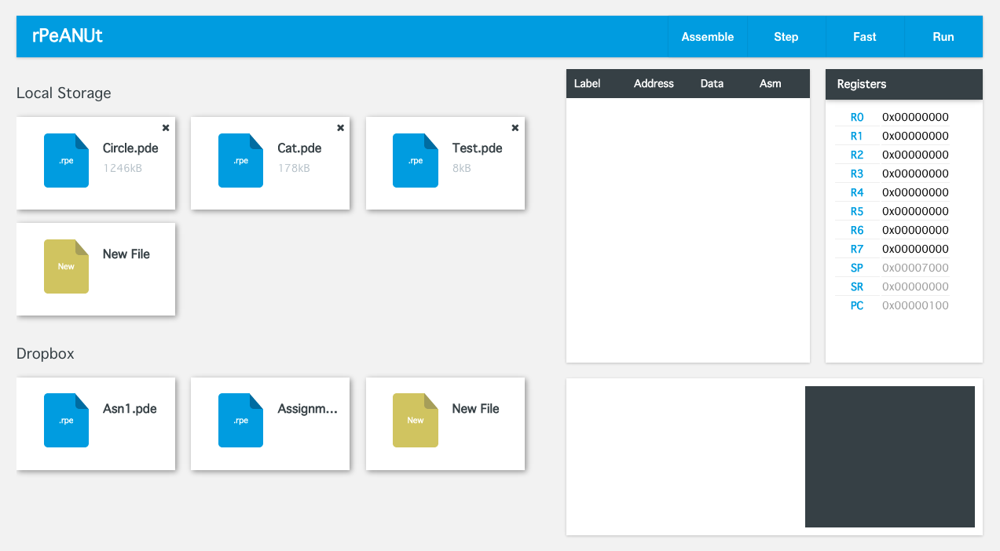

-   <a href="bf-interpreter">BF Interpreter</a> [2015] - BF interpreter in Haskell

# 2012 - 2014

-   <a href="./Dickson-IPS">Dickson-IPS</a> [2014] - Indoor Positioning System using RPis
-   <a href="./face-recognition-python">face-recognition-python</a> [2014] - Face recognition using OpenCV

-   <a href="dmd-pong">DMD Pong</a> [2014] - Pong on a DMD display controlled by hand movements

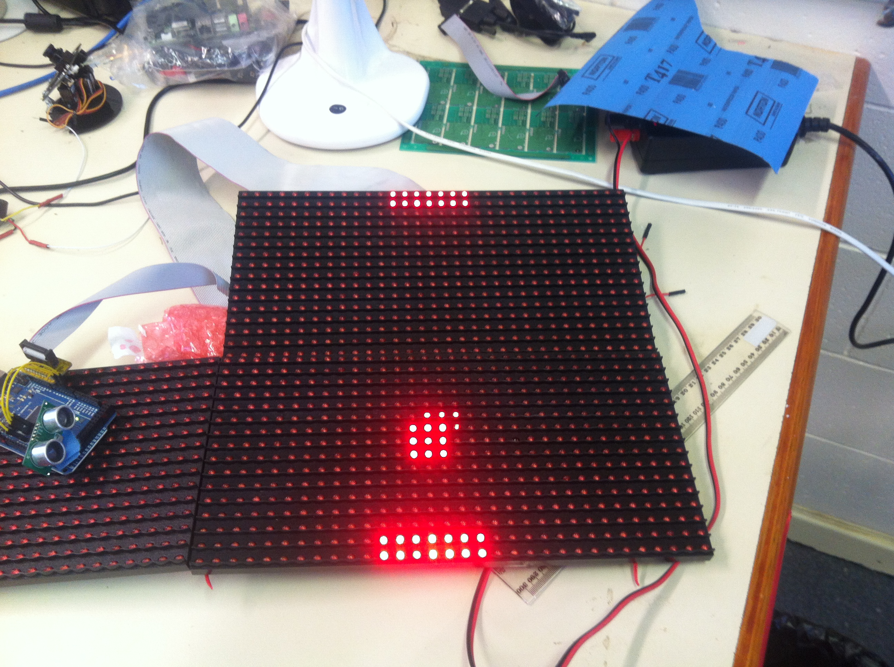

-   <a href="robotic-arm">Robot Arm</a> [2014] - Wooden Robotic Arm programmed with an Arduino

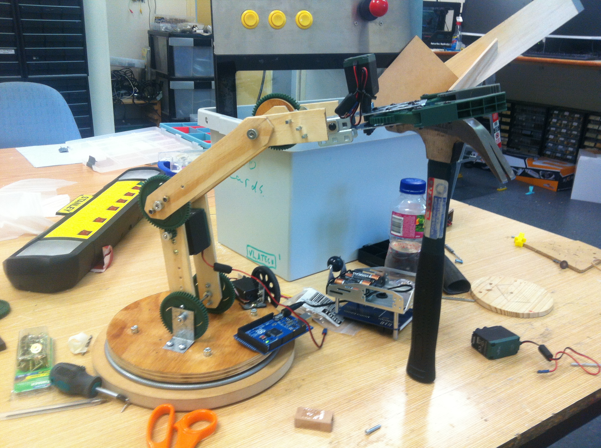

-   <a href="Search-Engine">Search Engine</a> [2012] - Search engine implemented for a Udacity course

-   <a href="pydecipher">pydecipher</a> [2012?] - simple cipher analysis and cracking tool in Python

-   <a href="Python-CBasic-Transpiler">Python-Casio-Transpiler</a> [2013] - Transpile Python code to Casio Basic for graphing calculators

-   <a href="dotfiles">Dotfiles</a> - Old dotfiles

Maths projects:

-   <a href="IFS-Fractals">IFS-Fractals</a> [2014] - Webapp for creating new IFS fractals

-   <a href="Complex-Bases">Complex-Bases</a> [2014] - Plot complex base numbers on a cartesian plane

-   <a href="Conics">Conics</a> [2014] - Encode an image as conic equations

