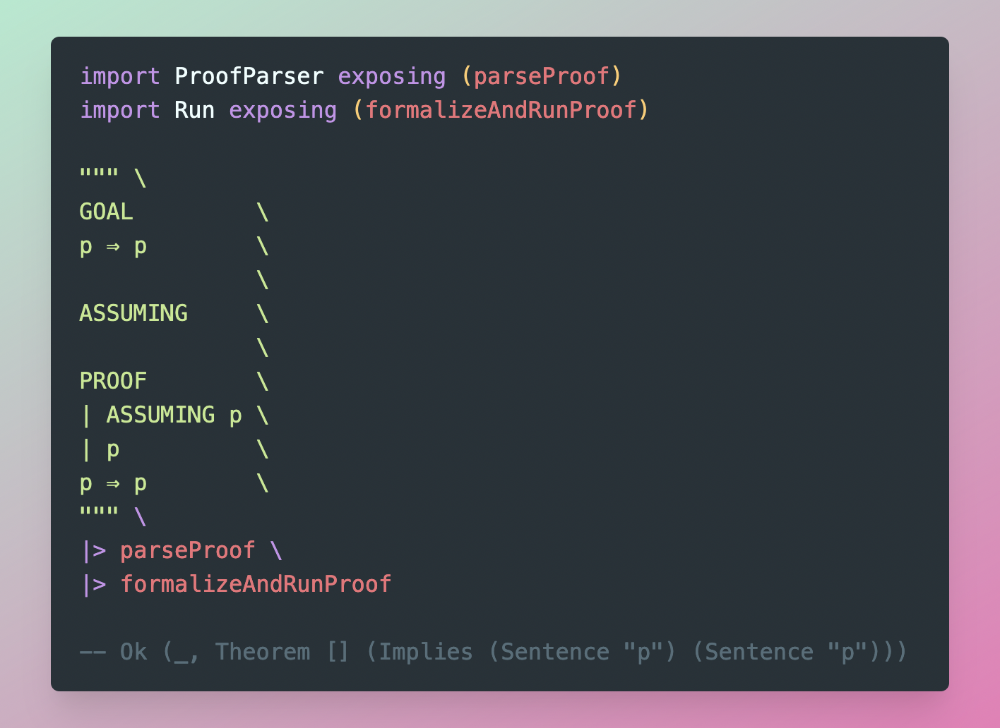
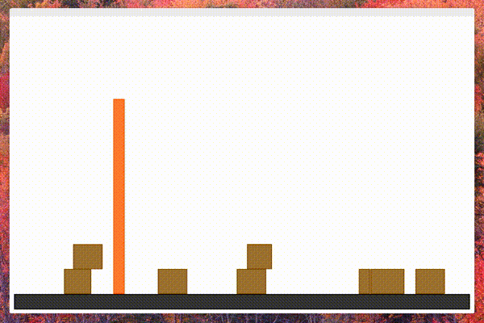

# Project Archive

A collection of archived projects, scripts and programs.

# 2019

-   <a href="./pr-oof">pr-oof [2019]</a> - propositional logic proof verifier in Elm

# 2017

-   <a href="./XScreenSaver-js">XScreenSaver-js [2017]</a> - A couple of XScreesavers implemented in JS

# 2016

-   <a href="./Expresso-Parser">Expresso-Parser [2016]</a> - Language Parser Generator used for calculator (uni assignment)

-   <a href="./Notedown">Notedown [2016]</a> - JAVA markdown Android app (uni assignment)

-   <a href="./PNG-Decoder">PNG-Decoder [2016]</a> - PNG decoder in Java

-   <a href="./xtm-parallel-coordinates">xtm-parallel-coordinates [2016]</a> - Graphing library built in Extempore

-   <a href="./xtm-physics">xtm-physics [2016]</a> - Simple 2D physics engine built in Extempore

-   <a href="./Govhack">Govhack [2014-2016]</a> - Series of hackathon entries

-   <a href="./arduino-guitar-pedal">arduino-guitar-pedal [2016]</a> - Arduino guitar effects pedal

# 2015

-   <a href="./Blockus-Java">Blockus-Java [2015]</a> - Blockus Android app (uni assignment))

 

-   <a href="./dash">dash [2015]</a> - TODO webapp

-   <a href="./rPeANUt-js">rPeANUt-js [2015]</a> - Hardware simulator and interface

-   <a href="bf-interpreter">BF Interpreter [2015]</a> - BF interpreter in Haskell

# 2012 - 2014

-   <a href="./Dickson-IPS">Dickson-IPS [2014]</a> - Indoor Positioning System using RPis
-   <a href="./face-recognition-python">face-recognition-python [2014]</a> - Face recognition using OpenCV

-   <a href="dmd-pong">DMD Pong [2014]

</a>

-   <a href="robotic-arm">Robot Arm [2014]

</a>

-   <a href="Search-Engine">Search Engine [2012]

</a>

-   <a href="pydecipher">pydecipher [2012?]

</a>

-   <a href="Python-CBasic-Transpiler">Python-Casio-Transpiler [2013]

</a>

-   <a href="dotfiles">Dotfiles

</a>

Maths projects:

-   <a href="IFS-Fractals">IFS-Fractals [2014]

</a>

-   <a href="Complex-Bases">Complex-Bases [2014]

<a/>

-   <a href="Conics">Conics [2014]

</a>
